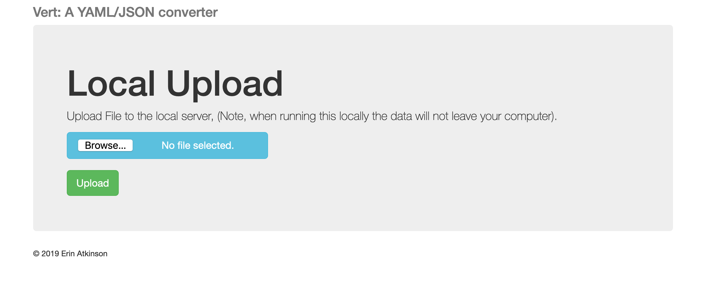

# Vert: A simple YAML/JSON converter

## Background

I had a simple dream, to have a json/yaml converter that I could run as either a CLI tool, a webserver, or an api server. The catch? I wanted the core engine(like 2 lines of code this time) to be the same no matter what.

Thus (con) vert was born.

## Installation

### Requisites

* Python 3.6+
* make (optional)

### Makefile

Running `make install` will create a directory `~/.local/bin/python` if it doesn't already exist.
Adding `~/.local/bin/python` to your $PATH variable will allow you to run `vert` from anywhere.

## Usage

`vert COMMAND`

### Commands

#### to_yaml

`vert to_yaml in_file --out_file=OUT_FILE`

reads in_file and writes to the corresponding out_file, if none is given, the filename without extension is used, but the converted extension is used. (eg. `vert to_yaml test.json` will write a `test.yaml` file in the same directory.

#### to_json

`vert to_json in_file --out_file=OUT_FILE`

reads in_file and writes to the corresponding out_file, if none is given, the filename without extension is used, but the converted extension is used. (eg. `vert to_json test.yaml` will write a `test.json` file in the same directory.

#### webserver

`vert webserver --port=8888`

starts a local flask webserver and opens the default browser to `localhost:port/upload`

#### apiserver

`vert apiserver --port=8080`

starts a local flask webserver, will respond to multipart form uploads via curl/api POSTs on `localhost:port/api/v1/upload`

## Limitations

This is basically a little side project to explicitly show myself that my idea wasn't out of the realm of possibility or reason, there's a LOT of edge cases and addenda that aren't covered. Under no circumstances should you run this as a production thing.

## Future thoughts

I plan on adding a docker manifests for this as well for both the webserver endpoint and the api endpoint.

## License

This project is licensed under the Apache 2.0 License [docs/LICENSE](docs/LICENSE).

## Code of Conduct

This project operates under the Contributor Covenant [docs/code-of-conduct.md](docs/code-of-conduct.md)
